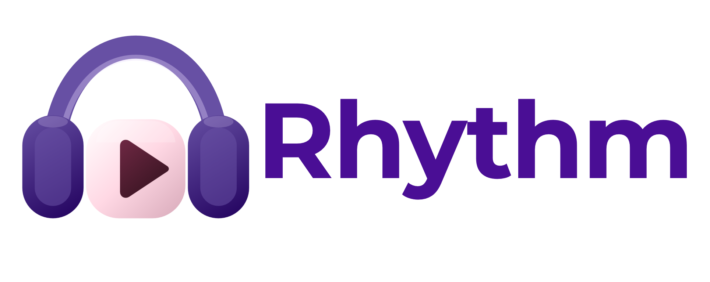
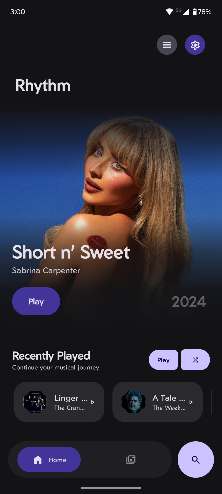
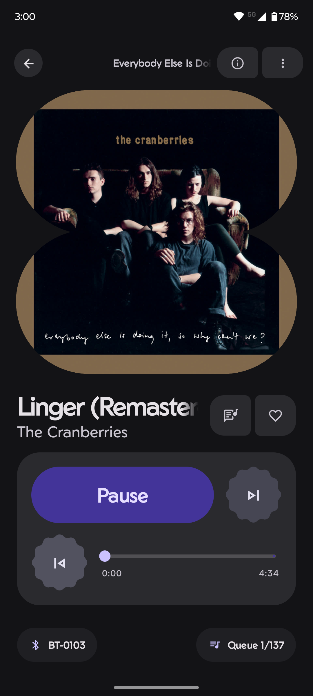
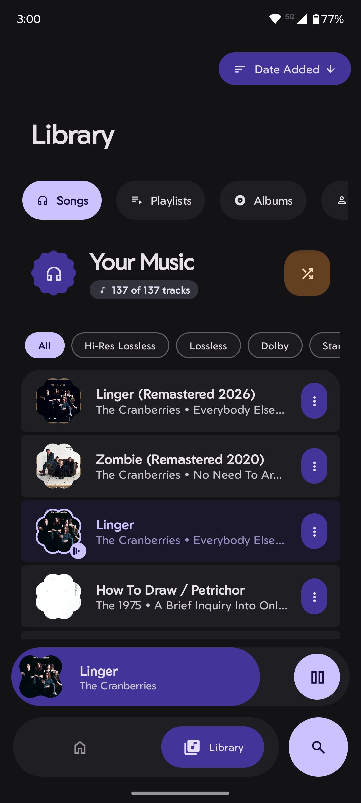
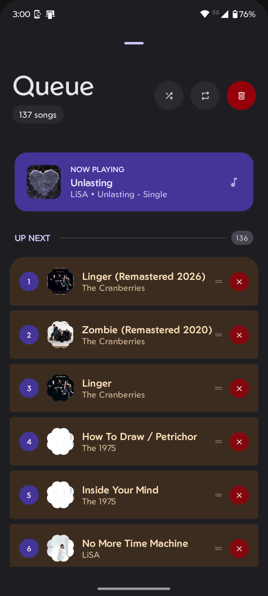
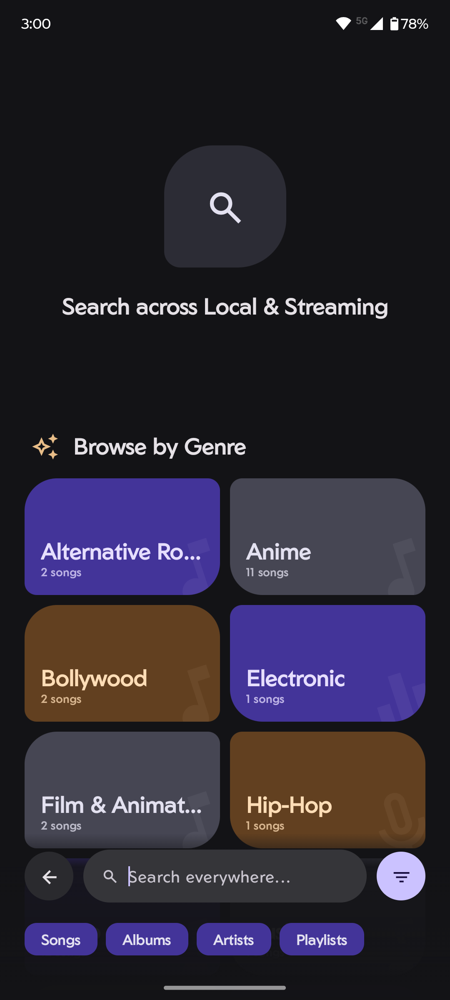
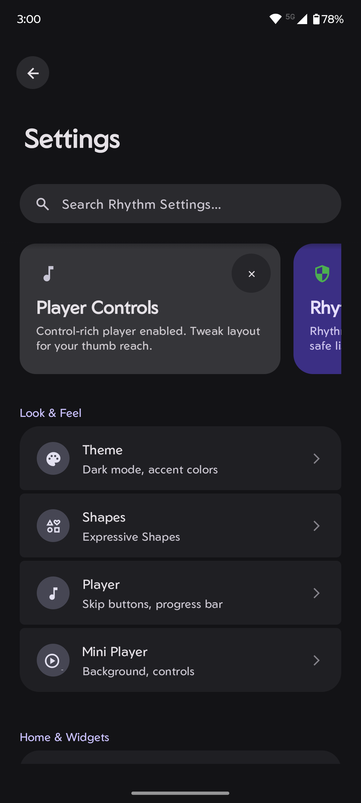

<div align="center">

<picture>
  <source media="(prefers-color-scheme: dark)" srcset="assets/icon.png">
  <source media="(prefers-color-scheme: light)" srcset="assets/icon.png">
  
</picture>

# Project Rhythm
**Your Music, Your Rhythm.**

<a href="https://trendshift.io/repositories/15217" target="_blank"></a>

[](https://android.com)
[](https://android-arsenal.com/api?level=26)
[](https://kotlinlang.org/)
[](docs/LICENSE)
<br>
[](https://github.com/cromaguy/Rhythm/releases/latest)
[](https://github.com/cromaguy/Rhythm/releases)
[](https://github.com/cromaguy/Rhythm/stargazers)
[](https://shields.rbtlog.dev/chromahub.rhythm.universe)

### [🌐 Website](https://rhythmweb.vercel.app/) • [📥 Download](https://github.com/cromaguy/Rhythm/releases/latest) • [🎧 Discord](https://discord.gg/vpRrk8AdVW) • [💬 Telegram](https://t.me/RhythmSupport) • [📖 Wiki](https://github.com/cromaguy/Rhythm/wiki)

</div>

---

## 💖 Support the Developer

Building and maintaining **Rhythm** is a massive labor of love, provided completely free and open-source. Due to my recent hardware failure, I am currently unable to push updates. If you love using this app, please consider supporting my hardware fund so I can return to development!

<div align="center">

| 🎯 **Main Goal** | ☕ **One-Time Support** | 🤝 **Ongoing Sponsorship** |
| :---: | :---: | :---: |
| [](https://ko-fi.com/anjishnunandi/goal?g=0) | [](https://ko-fi.com/anjishnunandi)<br><br>[](http://paypal.me/AnjishnuNandi) | [](https://patreon.com/AnjishnuNandi)<br><br>[](https://github.com/sponsors/cromaguy) |

</div>

---

## ✨ Why Choose Rhythm?

Rhythm is a modern, open-source music player built with **Material 3 Expressive** design. It delivers professional-grade audio with High-Resolution playback, EAC3-JOC/Dolby Atmos via FFmpeg, and completely respects your privacy.

| 🎨 **Design & UI** | 🎵 **Audio Engine** |
| :--- | :--- |
| **Material You:** Dynamic theming with wallpaper colors (Android 12+). | **Pro Audio:** Media3 ExoPlayer with gapless playback & High-Res mode. |
| **Expressive UI:** Refined adaptive shapes and Material 3 design. | **10-Band EQ:** Professional equalizer with 6032+ AutoEQ device presets. |
| **Modern Widgets:** Multiple responsive layouts for your home screen. | **Format Support:** FLAC, ALAC, MP3, AAC, EAC3-JOC, Opus, WAV, OGG. |

| 🎤 **Features & Tools** | 🔒 **Privacy & Data** |
| :--- | :--- |
| **Synced Lyrics:** LRCLib integration with word-by-word highlighting. | **100% FOSS:** Completely open-source with zero tracking. |
| **Smart Library:** Multi-select batch operations for songs and albums. | **Offline Capable:** Designed to work flawlessly without the internet. |
| **Playback Stats:** Comprehensive listening statistics and insights. | **Local First:** Your data and habits stay securely on your device. |
| **Streaming Mode:** Dual-mode architecture for local and server playback. | |
| **Rhythm Guard:** Integrated hearing safety and volume protection. | |

> **System Requirements:** Android 8.0+ (API 26) • 2GB RAM • 50MB Storage

---

## 📱 Screenshots

<div align="center">
<table>
<tr>
<td align="center" width="25%">

<br/><b>🏠 Smart Home</b>
</td>
<td align="center" width="25%">

<br/><b>▶️ Beautiful Player</b>
</td>
<td align="center" width="25%">

<br/><b>🎤 Synced Lyrics</b>
</td>
<td align="center" width="25%">

<br/><b>📚 Rich Library</b>
</td>
</tr>
<tr>
<td align="center">

<br/><b>📋 Smart Queue</b>
</td>
<td align="center">

<br/><b>🔍 Instant Search</b>
</td>
<td align="center">

<br/><b>⚙️ Deep Settings</b>
</td>
<td align="center">

<br/><b>🎤 Artist Pages</b>
</td>
</tr>
</table>
</div>

---

## 📥 Download & Install

Choose your preferred platform to download the latest version of Rhythm:

<div align="center">

| Source | Badge | Details |
| :--- | :---: | :--- |
| **GitHub** | [](https://github.com/cromaguy/Rhythm/releases/latest) | Direct universal APK downloads: unsigned release and debug artifacts (`chromahub.rhythm.universe`) |
| **Obtainium** | [](https://apps.obtainium.imranr.dev/redirect?r=obtainium://add/https://github.com/cromaguy/Rhythm/) | Auto-updates straight from GitHub |

</div>

> 💡 **Note:** GitHub releases include all features, including Deezer & YouTube Music artwork, LRCLib lyrics, and YouTube Music artwork. Release APKs are intentionally unsigned, and debug APKs use the `.debug` package suffix. See [Build Variants](docs/BUILD_VARIANTS.md) for details. Need help? Check out the [Installation Guide](https://github.com/cromaguy/Rhythm/wiki/Installation-Guide).

---

## 🛠 Technology Stack

Built with modern tools and clean architecture:

* **UI & Design:** Jetpack Compose, Material 3, Glance Widgets, Coil, AndroidX Palette.
* **Audio Engine:** Media3 ExoPlayer, FFmpeg Decoder, JAudioTagger.
* **Architecture:** MVVM + Clean Architecture, 100% Kotlin, Kotlin Coroutines + Flow.
* **Data & Network:** Room + SQLite, Retrofit, OkHttp, Gson.
* **Build & Management:** AGP, Kotlin, WorkManager, LeakCanary.

📖 **Full tech stack:** Read more in the [Wiki](https://github.com/cromaguy/Rhythm/wiki/Technology-Stack).

---

## 🤝 Contributing & Community

We welcome contributions! See our [CONTRIBUTING.md](https://github.com/cromaguy/Rhythm/blob/main/docs/CONTRIBUTING.md) for guidelines.

* 🐛 **Found a bug?** [Open an issue](https://github.com/cromaguy/Rhythm/issues)
* 💡 **Have an idea?** [Request a feature](https://github.com/cromaguy/Rhythm/issues)
* 💬 **Want to chat?** [Join Discord](https://discord.gg/vpRrk8AdVW), [Telegram](https://t.me/RhythmSupport) or [GitHub Discussions](https://github.com/cromaguy/Rhythm/discussions)
* 📖 **Need help?** [Read the Wiki](https://github.com/cromaguy/Rhythm/wiki)

---

## 🏆 Credits

**Lead Developer & Architect:** [Anjishnu Nandi](https://github.com/cromaguy)

**Huge Thanks To:**
* [Izzy](https://github.com/IzzySoft) - IzzyOnDroid repository management
* [theovilardo](https://github.com/theovilardo) - Project PixelPlayer collaboration & Lead Dev
* [Christian](https://github.com/mardous) - Project Booming collaboration & Lead Dev
* [Alex](https://github.com/Paxsenix0) - Network API integrations
* The **Google Material Design Team**, **AOSP**, **JetBrains**, and the fantastic **Open Source Community**.

---

<div align="center">

### ✨ Made with ❤️ by Team ChromaHub

<sub>**License:** [GNU General Public License v3.0](docs/LICENSE)</sub><br>
<sub>© 2026 Team ChromaHub. All rights reserved.</sub><br>
<sub>⭐ If Rhythm improved your daily listening, don't forget to star the repository! ⭐</sub>

</div>

## Marvel Spectrum MCU viewing metadata setup

CinemaVerse (formerly Rhythm) includes comprehensive MCU viewing-order and collection data with bundled local posters and metadata. The app defaults to viewing mode and works offline without any API keys or configuration.

### Bundled local data

All viewing data is bundled as local assets and requires zero external dependencies:

**JSON metadata:** `app/src/main/assets/mcu_data/mcu_titles.json`
- Contains MCU titles, viewing order, chronological order, saga grouping, phase information, release dates, and enrichment metadata (IMDB/TMDB IDs)

**Poster images:** `app/src/main/assets/mcu_posters/`
- Contains 50+ MCU movie and series posters in optimized formats
- Filenames match poster paths referenced in `posters.json`

**Poster mapping:** `app/src/main/assets/mcu_data/posters.json`
- Maps title IDs to poster filenames for flexible asset management

### How bundled data is loaded

At startup, `McuAssetDataSource` reads JSON from assets and resolves poster paths:

```
1. App loads mcu_titles.json from assets
2. Each title's posterPath is resolved to file:///android_asset/mcu_posters/<filename>
3. Coil image loader handles asset:// URIs natively
4. Posters are cached in memory and on disk
5. App works completely offline—no network required
```

### Artwork priority

When loading posters, the app tries sources in this order:

1. **Bundled local asset poster** (`file:///android_asset/mcu_posters/...`)
2. **Local curated override** (if configured in ViewingLists.kt)
3. **TMDB poster** (if API key configured and network available)
4. **OMDb poster** (if API key configured and network available)
5. **Built-in fallback** (MCU-themed gradient)

Missing poster files are handled gracefully—the item remains visible with a fallback gradient.

### Optional API enrichment (TMDB & OMDb)

For enhanced metadata (ratings, full cast, plot, runtime, etc.), configure optional API keys:

```bash
export OMDB_API_KEY="YOUR_OMDB_API_KEY"
export TMDB_API_KEY="YOUR_TMDB_API_KEY"
export TMDB_READ_ACCESS_TOKEN="YOUR_TMDB_READ_ACCESS_TOKEN"
./gradlew :app:assembleGithubDebug
```

**Important:** API keys are optional. The app is fully functional with bundled data alone. Missing keys produce a logged warning but do not block startup or features.

**Real API credentials must never be committed.** Use environment variables or CI/CD secrets.

### Editing viewing lists and metadata

Curated list membership, order, phase, saga, and descriptions are configured in:

```
app/src/main/java/com/cinemaverse/mcu/shared/data/viewing/ViewingLists.kt
```

Add or edit collections by modifying the `allLists` section. The structure is:

```kotlin
ViewingList(
    id = "unique-id",
    title = "Display Name",
    description = "Human-friendly description",
    phase = "Phase One",
    saga = "Infinity Saga",
    franchise = "Marvel Cinematic Universe",
    items = listOf(/* viewing items */)
)
```

Bundled local data and curated collections are merged intelligently:
- **Local values** are preserved when provided
- **JSON values** fill gaps and provide additional enrichment
- **API data** enriches further if keys are configured
- **Local posters** take precedence over remote URLs

### Disabling music mode

CinemaVerse defaults to MCU viewing mode. Music integrations (YouTube Music, Spotify, Apple Music, Deezer) are disabled in build.gradle.kts:

```gradle
buildConfigField("boolean", "ENABLE_YOUTUBE_MUSIC", "false")
buildConfigField("boolean", "ENABLE_APPLE_MUSIC", "false")
buildConfigField("boolean", "ENABLE_DEEZER", "false")
buildConfigField("boolean", "ENABLE_SPOTIFY_SEARCH", "false")
```

To re-enable music features, change these flags to `"true"` and recompile.

### Development workflow

1. **Add new titles:** Edit `mcu_titles.json` and add poster images to `app/src/main/assets/mcu_posters/`
2. **Update lists:** Modify `ViewingLists.kt` and rebuild
3. **Test offline:** Build and run without setting API keys; app works fully offline
4. **Test with APIs:** Export API keys and rebuild to verify enrichment works
5. **Commit safely:** Never commit API keys; use environment variables only
